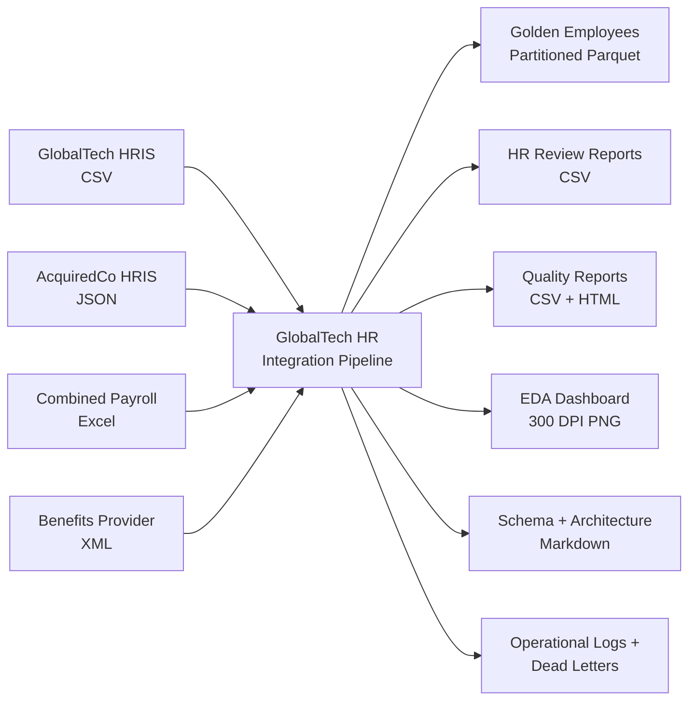
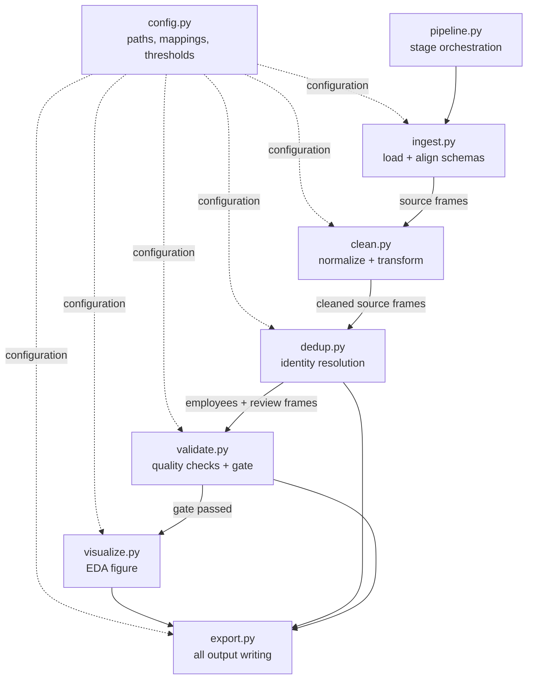
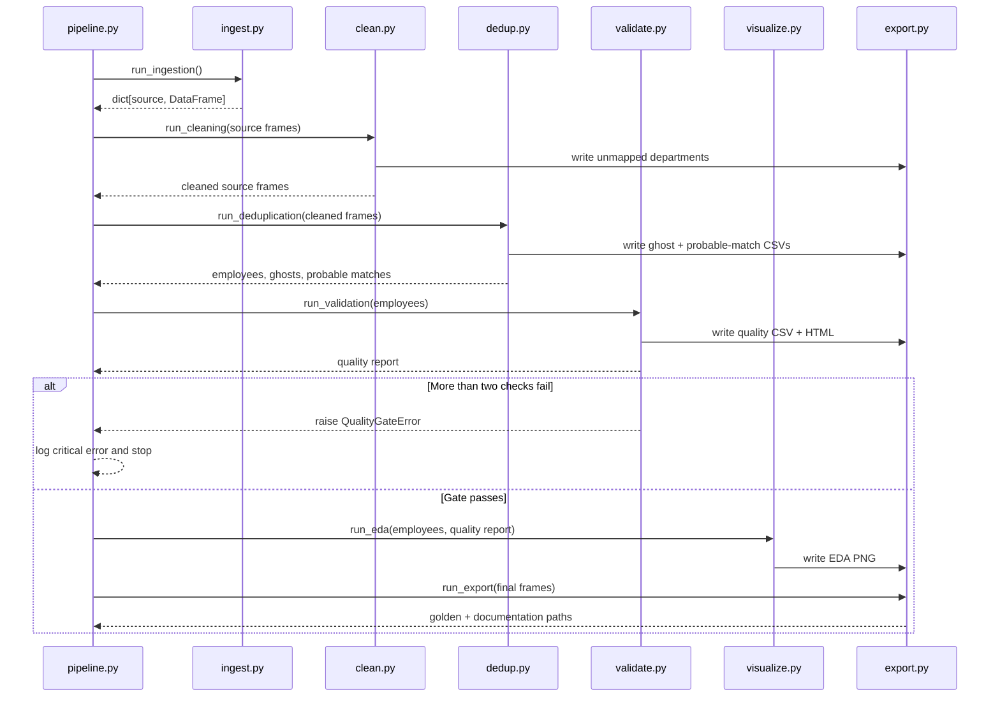
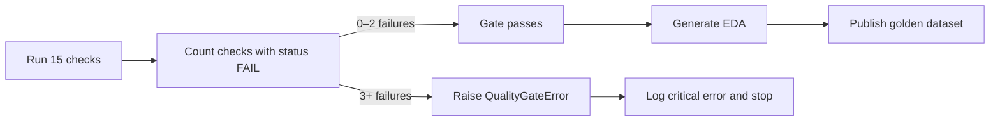

# GlobalTech HR Pipeline Architecture

## 1. Purpose and scope

This document describes the architecture of the GlobalTech HR data integration
pipeline. The pipeline consolidates GlobalTech and AcquiredCo HR data into a
validated employee dataset suitable for downstream HR reporting and analysis.

The architecture is designed for:

- deterministic local batch processing;
- traceability from source records to golden employee records;
- conservative identity resolution;
- explicit data-quality gating before publication;
- independent execution and testing of each pipeline stage.

The pipeline runs in a single Python process and exchanges pandas DataFrames
between stages. The filesystem is the source and output boundary; no database,
message broker, or external API is required.

## 2. System context



## 3. Logical architecture



`pipeline.py` coordinates the workflow but does not own transformation logic.
Each stage exposes focused functions that can also be called independently.
`export.py` is the only module responsible for writing pipeline artifacts,
apart from logging configured in `config.py`.

## 4. Runtime sequence



## 5. Module responsibilities

### `config.py`

Centralizes:

- source and output paths;
- standard employee schema;
- exchange rates and pay-frequency multipliers;
- employment and department mappings;
- source priority;
- fuzzy-match and validation thresholds;
- logger initialization.

Configuration is imported by the stage modules so business rules remain
consistent across cleaning, matching, validation, and export.

### `ingest.py`

Loads the four native formats and aligns each source to the configured standard
schema:

- GlobalTech HRIS: CSV;
- AcquiredCo HRIS: nested JSON with simulated pagination;
- payroll: Excel;
- benefits: XML.

Malformed records and file-level failures are written to source-specific dead
letters. Each valid output row receives `source_system` and `company_origin`
provenance.

### `clean.py`

Applies source-independent normalization:

- Unicode and whitespace normalization for names;
- employee and manager ID namespacing;
- employment-type taxonomy mapping;
- department mapping and exception reporting;
- mixed-format date parsing and invalid-date flags;
- salary parsing, annualization, and USD conversion.

Cleaning preserves raw values such as `employee_id_raw`,
`department_original`, and `base_salary` for auditability.

### `dedup.py`

Uses HRIS records as the employee spine and applies three matching passes:

1. **Exact namespaced ID** — auto-merge payroll and benefits enrichment into
   the matching HRIS employee.
2. **Cross-company email** — auto-merge only when the same normalized email
   appears in both companies.
3. **Fuzzy name + hire-date window** — produce an HR review candidate; do not
   auto-merge.

Payroll records without an HRIS employee ID are emitted as ghost employees.
Every golden employee contains `source_systems` and `dedup_method`.

### `validate.py`

Runs 15 checks covering:

- required values;
- uniqueness;
- allowed taxonomies;
- email and employee-ID formats;
- salary and hire-date ranges;
- manager referential integrity.

Each check passes when its record-level pass rate is at least 95%. The overall
pipeline gate permits at most two failed checks. More than two failed checks
raise `QualityGateError` and prevent EDA and golden dataset publication.

### `visualize.py`

Builds a six-panel, colorblind-safe EDA report showing headcount, geography,
compensation, tenure, benefits enrollment, and data-quality results. The report
is rendered as a 300 DPI PNG with generation metadata and source annotations.

### `export.py`

Owns output serialization:

- CSV review and exception reports;
- quality report CSV and HTML;
- EDA PNG delegation;
- golden Parquet dataset;
- generated schema documentation.

The golden dataset is partitioned by `company_origin`, allowing consumers to
read all employees or one company partition.

### `pipeline.py`

Exposes stage-level entry points and the complete `run_pipeline()` workflow. It
passes in-memory DataFrames between stages, enforces stage ordering, handles
the quality-gate exception, logs the final summary, and returns both DataFrames
and artifact paths to programmatic callers.

## 6. Data contracts

### Stage contracts

| Stage | Input | Output |
| --- | --- | --- |
| Ingestion | Four raw files | `dict[str, DataFrame]` aligned to the standard schema |
| Cleaning | Aligned source frames | Cleaned source frames with raw-value and invalid-value metadata |
| Deduplication | Cleaned source frames | `employees`, `ghost_employees`, `probable_matches` |
| Validation | Deduplicated employees | Quality report DataFrame |
| Visualization | Employees + quality report | EDA PNG path |
| Export | Final DataFrames | Golden dataset and report/documentation paths |

### Golden employee grain

The golden dataset has one row per surviving canonical `employee_id`.

- HRIS supplies the identity and person spine.
- Payroll and benefits are enrichment sources.
- Benefits plan-grain records are aggregated before joining.
- Fuzzy candidates remain separate until HR approves them.

The complete field-level contract is maintained in
[`schema.md`](schema.md).

## 7. Identity and provenance model

Native IDs overlap across companies, so all employee and manager IDs are
namespaced:

- GlobalTech: `GT-######`;
- AcquiredCo: `AC-######`.

Source precedence is:

1. HRIS;
2. payroll;
3. benefits.

Two fields make identity decisions traceable:

- `source_systems`: all source systems contributing to the record;
- `dedup_method`: `exact_id`, `email_match`, `fuzzy_name`, or
  `single_source`.

`fuzzy_name` appears in the probable-match review output rather than on an
auto-merged golden record.

## 8. Quality gate and failure handling



Failure behavior is intentionally stage-specific:

- malformed source records are dead-lettered and skipped;
- missing source keys required by deduplication raise immediately;
- nonconforming values are retained or flagged where review is useful;
- quality reports are exported before the gate decision;
- golden publication occurs only after the gate passes.

## 9. Storage layout

```text
data/
├── raw/
│   ├── globaltech_hris.csv
│   ├── acquiredco_api.json
│   ├── payroll_data.xlsx
│   └── benefits_enrollment.xml
└── processed/
    ├── golden_employees/
    │   ├── company_origin=GlobalTech/
    │   └── company_origin=AcquiredCo/
    ├── dead_letter/
    ├── ghost_employees.csv
    ├── probable_matches.csv
    ├── quality_report.csv
    ├── quality_report.html
    ├── hr_eda_report.png
    └── unmapped_departments.csv
```

The pipeline replaces the golden Parquet directory on each successful export.
CSV and HTML reports are also rewritten, while dead-letter files are appended.

## 10. Operational characteristics

- **Execution model:** local synchronous batch.
- **State:** no application database; files are the durable boundary.
- **Re-runs:** transformations are deterministic for the same inputs and
  configuration, except generated timestamps and appended dead letters.
- **Observability:** stage logs, row counts, validation results, artifact paths,
  and duration are written to console and `logs/pipeline.log`.
- **Security:** the project assumes a controlled local environment. Production
  deployment would require access controls, encryption, and retention rules
  for employee PII.

## 11. Testing strategy

The pytest suite uses small in-memory DataFrames and temporary directories to
test transformations without repeatedly processing the full raw dataset.

Coverage includes:

- schema alignment and cleaning rules;
- aggregation, exact/email/fuzzy matching, and ghost detection;
- validation checks and gate boundaries;
- CSV, schema, Parquet, and PNG outputs;
- pipeline orchestration with mocked stage boundaries.

Run the suite from the project root:

```bash
python3 -m pytest
```

## 12. Design decisions and trade-offs

1. **Pandas and local files** keep the project simple and transparent for the
   current data volume, but do not provide distributed processing.
2. **HRIS as the employee spine** avoids publishing payroll-only identities as
   employees; those records are instead reviewed as ghosts.
3. **Conservative fuzzy matching** reduces false merges at the cost of manual
   HR review.
4. **Centralized output writing** keeps transformations testable and makes
   storage changes easier to isolate.
5. **Partitioning by company origin** improves company-level reads while
   preserving a unified dataset.
6. **A check-count gate** follows the project requirement, although a
   production gate may also weight critical checks differently.

## 13. Evolution path

For larger or production workloads, the current module boundaries support:

- replacing pandas transformations with Spark or another distributed engine;
- reading from APIs/object storage rather than local files;
- writing golden data to a cataloged lakehouse table;
- moving configuration into environment-specific files;
- adding approved fuzzy matches to a persistent identity crosswalk;
- scheduling with Airflow, Dagster, or another orchestrator;
- publishing metrics and alerts to a monitoring platform.
